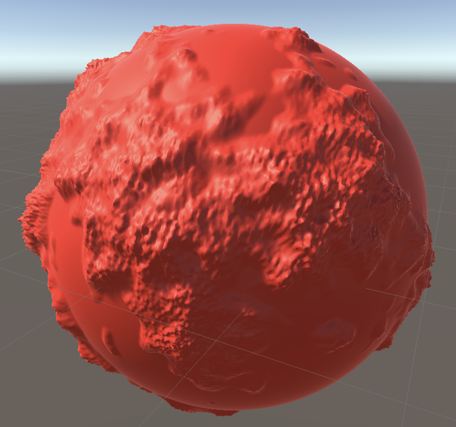
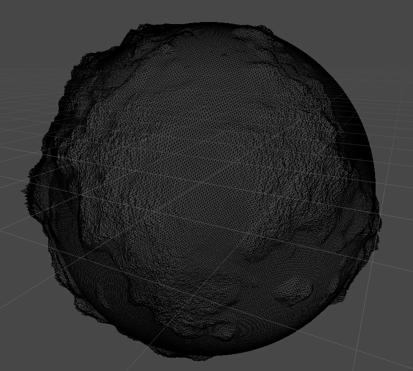
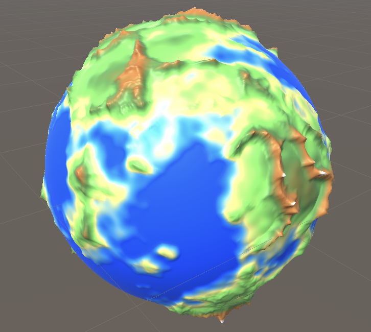

# Destination: Deep Space

A world generated through procedures that simulates the most beautiful thing in
life: The Circle of Life!

Current progress was made by following a [tutorial by Sebastian Lague](https://youtu.be/QN39W020LqU)

## Screenshots

